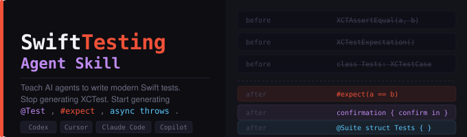

<p align="center">
  
</p>


# SwiftTesting-Agent-Skill

**Teach AI coding agents to write modern Swift tests.**

Most AI tools still generate legacy XCTest patterns.  
This skill upgrades them to use the Swift Testing framework introduced in Xcode 16.

---

## Before / After

| Without this skill | With this skill |
|---|---|
| `class LoginTests: XCTestCase` | `@Suite struct LoginTests` |
| `XCTAssertEqual(user.name, "Alice")` | `#expect(user.name == "Alice", "Name should match registration input")` |
| `XCTUnwrap(response.token)` | `try #require(response.token, "Token must exist after successful auth")` |
| `expectation(description: "fetch")` + `waitForExpectations(timeout: 5)` | `@Test func fetchesUser() async throws { }` |
| 4 repeated test methods for 4 inputs | `@Test(arguments: inputs) func validates(input: String)` |
| `XCTestExpectation` for delegate callbacks | spy class + `await confirmation { }` |

---

## The Problem

Ask any AI coding tool to write a Swift test and you'll get this:

```swift
// What AI agents generate today
class UserServiceTests: XCTestCase {
    func testFetchUser() {
        let expectation = expectation(description: "fetch")
        service.fetchUser(id: "123") { result in
            XCTAssertNotNil(result)
            expectation.fulfill()
        }
        waitForExpectations(timeout: 5)
    }
}
```

Modern Swift uses the Swift Testing framework. The correct output looks like this:

```swift
// What AI agents should generate
@Test func fetchUser() async throws {
    let user = try await service.fetchUser(id: "123")
    #expect(user != nil)
}
```

---

## What This Skill Teaches

- `@Test` functions — replacing `func testXxx()` in `XCTestCase`
- `#expect` and `#require` — replacing `XCTAssert*` family
- `async` test functions — replacing `expectation(description:)` + `waitForExpectations`
- Parameterized tests — replacing repeated test methods
- `confirmation {}` — replacing `XCTestExpectation` for event-based testing
- `@Suite` — replacing `XCTestCase` class structure
- Tags and traits — filtering, disabling, timing

---

## Compatible With

- [Codex](https://openai.com/codex)
- [Cursor](https://cursor.sh)
- [Claude Code](https://claude.ai/code)
- [GitHub Copilot](https://github.com/features/copilot)
- Any agent that reads Markdown context files

---

## Repo Structure

``` 
SwiftTesting-Agent-Skill/
├── assets/
│   └── banner.svg                          ← Repository banner
└── skill/
    ├── SKILL.md                            ← Start here — agent entry point
    ├── patterns/
    │   ├── test-functions.md               ← @Test, @Suite, naming, tags
    │   ├── assertions.md                   ← #expect, #require, throwing
    │   ├── assert-messages.md              ← When and how to write assertion messages
    │   ├── async-tests.md                  ← async/await, confirmation {}
    │   └── parameterized-tests.md          ← Arguments, combos, Identifiable
    ├── anti-patterns/
    │   ├── xctest-leftovers.md             ← What to stop generating
    │   └── common-mistakes.md              ← Mistakes agents make in Swift Testing
    ├── migration/
    │   └── xctest-to-swift-testing.md      ← Full side-by-side migration guide
    └── examples/
        ├── networking-tests.md             ← Async URLSession service layer tests
        ├── viewmodel-tests.md              ← @MainActor ViewModel tests
        ├── swiftui-tests.md                ← @Observable, routing, form validation
        ├── delegate-tests.md               ← URLSessionDelegate, CLLocationManagerDelegate
        └── snapshot-style-tests.md         ← Structural output and state machine tests
```

---

## How to Use

### With Claude Code
Point Claude Code to `skill/SKILL.md` in your project or add this to your `CLAUDE.md`:

```
When writing Swift tests, read skill/SKILL.md and follow all patterns exactly.
```

### With Cursor
Add to `.cursorrules`:

```
When generating Swift test files, use the Swift Testing framework.
Follow the patterns in skill/SKILL.md.
Never use XCTestCase, XCTAssert*, or waitForExpectations.
```

### With Codex
Include `skill/SKILL.md` in your prompt context.

---

## Requirements

- Swift 5.10+ / Xcode 16+
- iOS 16+ / macOS 13+ deployment target
- Swift Testing is included in the Swift toolchain — no SPM dependency needed

---

## Optional Integration

If you use **AsyncGuardKit** for structured async cancellation, see `skill/examples/networking-tests.md` for test patterns that work alongside it.

---

## Contributing

PRs welcome. If you find a pattern that AI agents consistently get wrong, open an issue or add a file to `skill/anti-patterns/`.

---

## License

MIT
